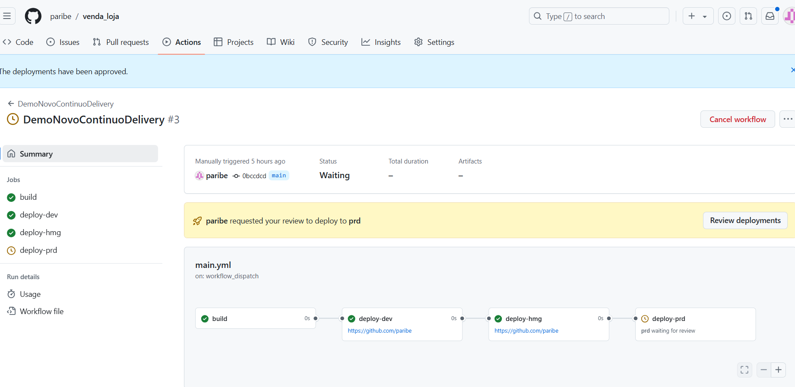
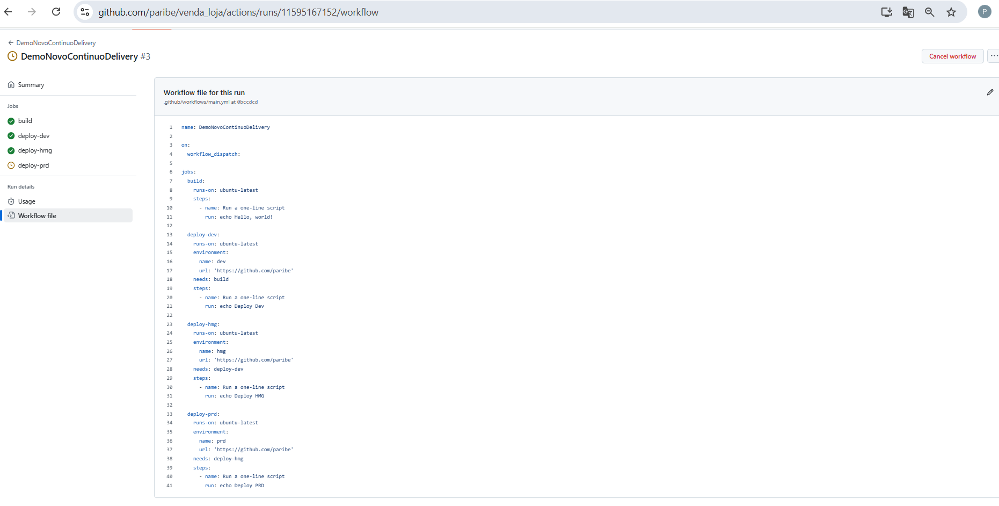
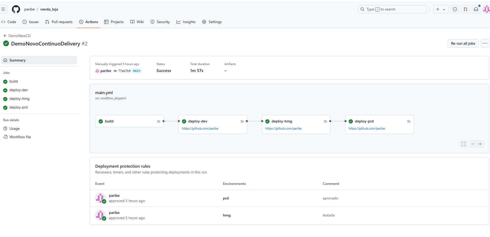
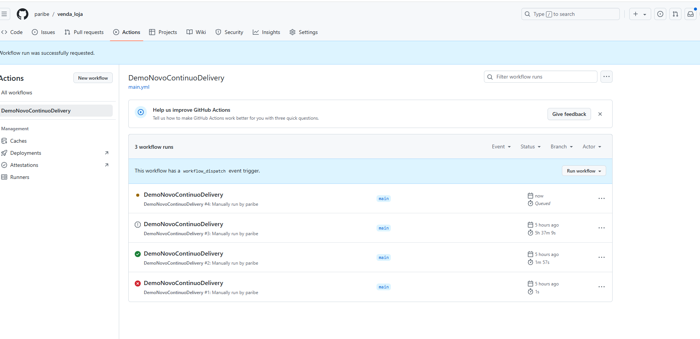
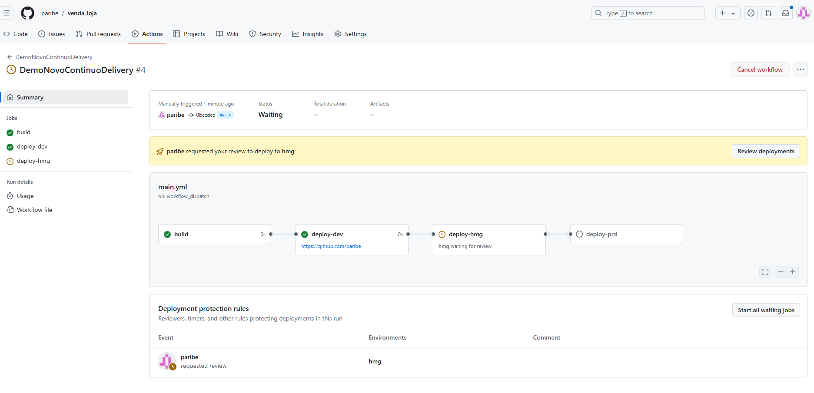
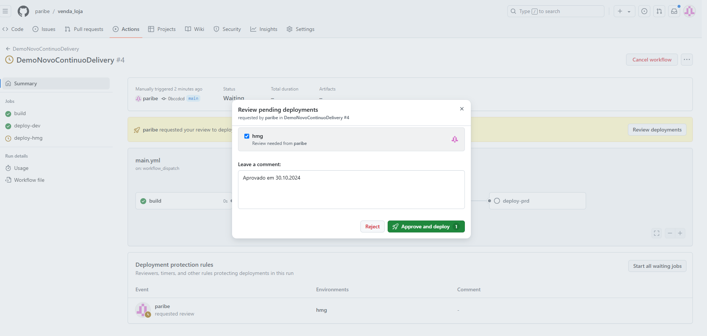
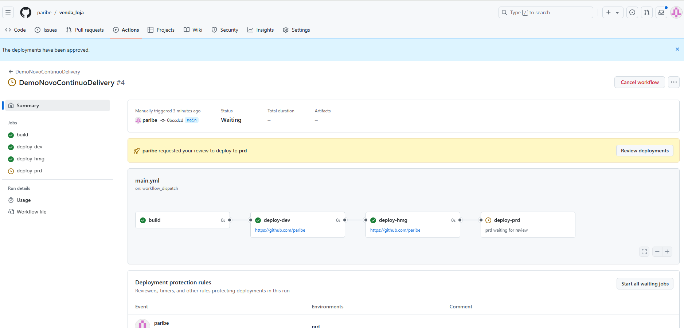
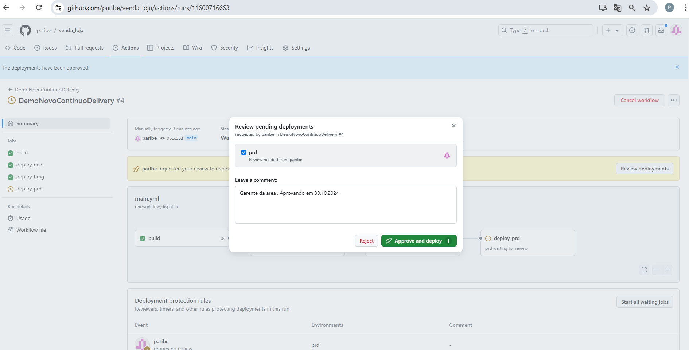
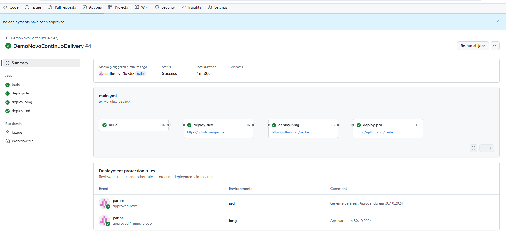

# Pipeline de Implantação - GitHub Actions

Este repositório contém um pipeline de implantação configurado com GitHub Actions para automação do processo de implantação em diferentes ambientes (dev, hmg e prd). Este pipeline é acionado manualmente e executa etapas de construção e implantação sequenciais para os ambientes definidos.

## Descrição do Workflow

O workflow é definido no arquivo `.github/workflows/main.yml` e é composto pelos seguintes jobs:

### Estrutura do Workflow

```
yaml
name: DemoNovaContinuaDelivery

on:
  workflow_dispatch:

jobs:
  build:
    runs-on: ubuntu-latest
    steps:
      - name: Run a one-line script
        run: echo Hello, world!

  deploy-dev:
    runs-on: ubuntu-latest
    environment:
      name: dev
      url: 'https://github.com/paribe'
    needs: build
    steps:
      - name: Run a one-line script
        run: echo Deploy Dev

  deploy-hmg:
    runs-on: ubuntu-latest
    environment:
      name: hmg
      url: 'https://github.com/paribe'
    needs: deploy-dev
    steps:
      - name: Run a one-line script
        run: echo Deploy HMG

  deploy-prd:
    runs-on: ubuntu-latest
    environment:
      name: prd
      url: 'https://github.com/paribe'
    needs: deploy-hmg
    steps:
      - name: Run a one-line script
        run: echo Deploy PRD
    
```

    Imagens:








# Executando:



# Aprovação











